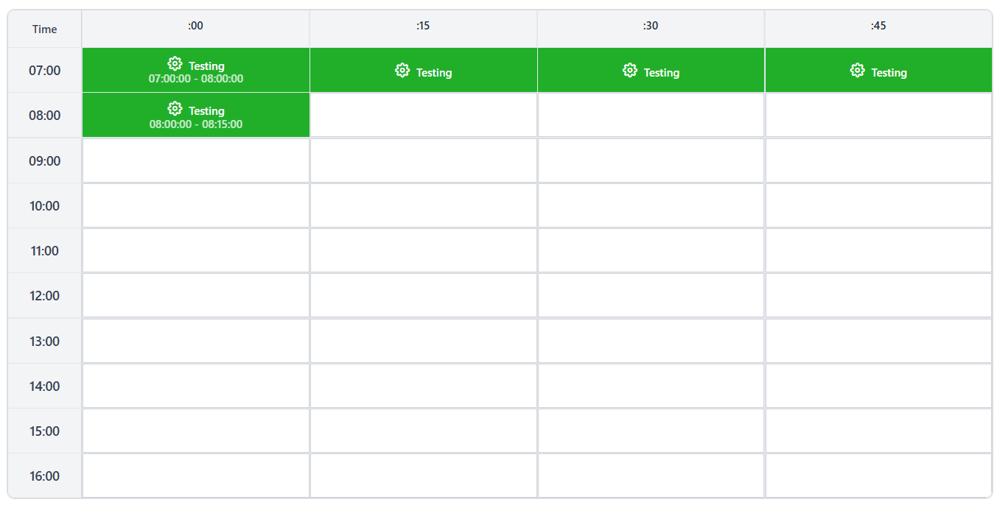
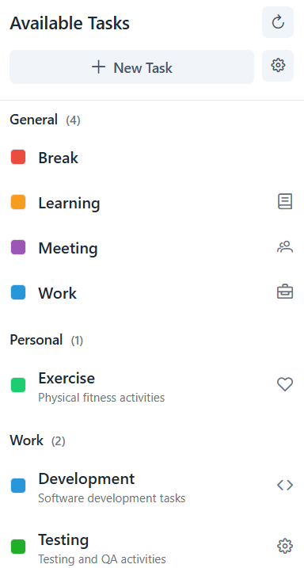
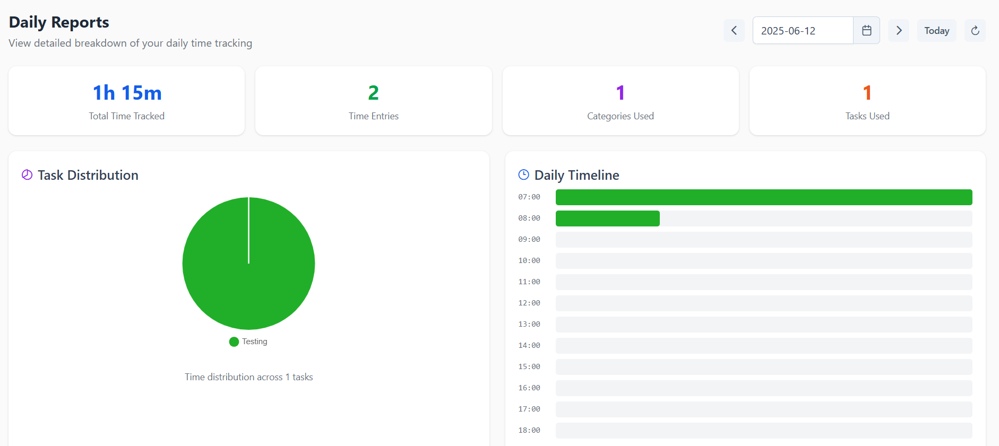

# Project Cronos

[](https://opensource.org/licenses/MIT)
[](https://spring.io/projects/spring-boot)
[](https://nuxt.com/)
[](https://www.postgresql.org/)
[](https://www.docker.com/)

A self-hostable time tracking application with an intuitive drag-and-paint interface for visual time tracking. Track your time across categories and tasks with real-time validation, comprehensive reporting, and seamless data export capabilities.

## 💡 Inspired by [quarter](https://github.com/eliasson/quarter)

- This project was inspired by [quarter](https://github.com/eliasson/quarter), which was originally written is C# using the Blazor framework. Please do check them out!!
- Although I loved the project, I was not familiar with the framework, thus, I took that inspiration to whip up something similar in Spring Boot and Nuxt.
- As a quick story, I want a fun way to organize my tasks and time entry for inputting into Jira at the end of the day. Plus, having something like this would help me with the status updates in the countless standups, so I don't have to scramble my memory every morning to recount on what I've done.
- This might be something that could help you if you're in a similar position as me, or could even be used for a whole different purpose. Either way, I hope this helps you in some way! 🙂

## ✨ Features

- **🎨 Visual Time Tracking**: Drag-and-paint interface on a daily timesheet with 15-minute granularity
  - 
- **📊 Smart Organization**: Create categories and color-coded tasks for easy identification
  - 
- **⚡ Real-time Validation**: Automatic overlap detection and duration validation
- **📈 Comprehensive Reports**: Daily, weekly summaries with visual breakdowns
  - 
- **📤 Data Export**: CSV export with custom date ranges
- **📱 Mobile Responsive**: Works seamlessly on desktop, tablet, and mobile
- **🐳 Container Ready**: Full Docker support for easy deployment
- **🔒 Self-hostable**: Complete control over your data

## 🚀 Quick Start

### Using Docker (Recommended)

```bash
# Clone the repository
git clone https://github.com/trashykoifish1/project-cronos.git
cd project-cronos

# Start the application
docker-compose up -d

# Access the application
open http://localhost:3000
```

That's it! The application will be running with a PostgreSQL database.

### Manual Setup

**Prerequisites:**

- Node.js 20+
- Java 21+
- Maven 3.9+
- PostgreSQL 15+

**Backend Setup:**

```bash
cd backend
mvn clean install
mvn spring-boot:run
# Backend running on http://localhost:8080
```

**Frontend Setup:**

```bash
cd frontend
npm install
npm run dev
# Frontend running on http://localhost:3000
```

**Database Setup:**

```bash
# Create PostgreSQL database
createdb timetracker

# Update backend/src/main/resources/application.properties
spring.datasource.url=jdbc:postgresql://localhost:5432/timetracker
spring.datasource.username=your_username
spring.datasource.password=your_password
```

## 🏗️ Architecture

```
┌─────────────────┐    ┌─────────────────┐    ┌─────────────────┐
│   Frontend      │    │    Backend      │    │   Database      │
│   (Nuxt 3)      │◄──►│  (Spring Boot)  │◄──►│  (PostgreSQL)   │
│   Port: 3000    │    │   Port: 8080    │    │   Port: 5432    │
└─────────────────┘    └─────────────────┘    └─────────────────┘
```

### Technology Stack

**Frontend:**

- **Framework**: Nuxt 3 (Vue.js)
- **UI Library**: PrimeVue + PrimeFlex
- **State Management**: Pinia
- **TypeScript**: Full type safety

**Backend:**

- **Framework**: Spring Boot 3
- **Database**: PostgreSQL with Flyway migrations
- **API**: RESTful with OpenAPI/Swagger documentation
- **Validation**: Comprehensive business rules

**Deployment:**

- **Containerization**: Docker + Docker Compose
- **Database**: PostgreSQL container
- **Reverse Proxy**: Nginx (production)

## 📋 Usage

### 1. **Categories & Tasks Setup**

- Create categories to organize your work (e.g., "Work", "Personal", "Learning")
- Add tasks within categories with unique colors for visual identification
- Archive unused categories/tasks to keep your workspace clean

### 2. **Time Tracking**

- Navigate to any date using the date picker
- Select a task from the sidebar or dropdown
- Click and drag on the timesheet grid to paint time slots
- Real-time validation prevents overlaps and enforces business rules

### 3. **Reports & Analytics**

- View daily summaries with time breakdowns by category and task
- Export data as CSV for external analysis
- Get productivity insights and warnings for unusual patterns

### 4. **Data Management**

- All data is automatically saved in real-time
- Soft deletion preserves data integrity when archiving
- Full data export capabilities for backup or migration

## 🔧 Development

### Project Structure

This is just an outline of what the project structure looks like.

- The **backend** follows a typical Spring Boot layout.
- The **frontend** follows the conventional Nuxt layout.

```
time-tracker/
├── backend/               # Spring Boot application
│   ├── src/main/java/    # Java source code
│   ├── src/main/resources/ # Configuration & migrations
│   └── pom.xml           # Maven dependencies
├── frontend/             # Nuxt 3 application
│   ├── components/       # Vue components
│   ├── pages/           # Route pages
│   ├── stores/          # Pinia stores
│   └── package.json     # NPM dependencies
├── docker-compose.yml    # Full stack deployment
└── docs/                # Additional documentation
```

### API Documentation

- **Swagger UI**: http://localhost:8080/swagger-ui.html
- **OpenAPI Spec**: http://localhost:8080/v3/api-docs
- **Health Check**: http://localhost:8080/api/health

### Key API Endpoints

```bash
# Categories
GET    /api/categories/active
POST   /api/categories
PUT    /api/categories/{id}

# Tasks
GET    /api/tasks/active
POST   /api/tasks
PUT    /api/tasks/{id}

# Time Entries
GET    /api/time-entries/date/{date}
POST   /api/time-entries
POST   /api/time-entries/bulk

# Reports
GET    /api/reports/daily/{date}
GET    /api/export/time-entries/csv
```

## 🤝 Contributing

We welcome contributions! Please see our [Contributing Guide](CONTRIBUTING.md) for details.

### Quick Contribution Steps

1. Fork the repository
2. Create a feature branch (`git checkout -b feature/amazing-feature`)
3. Make your changes following our coding standards
4. Add tests for new functionality
5. Commit your changes (`git commit -m 'Add amazing feature'`)
6. Push to the branch (`git push origin feature/amazing-feature`)
7. Open a Pull Request

### Development Workflow

- All changes require tests
- Backend changes need integration tests
- Frontend changes need component tests
- Follow existing code patterns and conventions

## 📄 License

This project is licensed under the MIT License - see the [LICENSE](LICENSE) file for details.

## 🙏 Acknowledgments

- Built with assistance from [Claude](https://claude.ai/)
- Built with [Spring Boot](https://spring.io/projects/spring-boot) and [Nuxt 3](https://nuxt.com/)
- UI components by [PrimeVue](https://primevue.org/)
- Icons by [PrimeIcons](https://github.com/primefaces/primeicons)

## 📞 Support

- 🐛 [Report Bugs](https://github.com/yourusername/time-tracker/issues/new?template=bug_report.md)
- 💡 [Request Features](https://github.com/yourusername/time-tracker/issues/new?template=feature_request.md)
- 💬 [Discussions](https://github.com/yourusername/time-tracker/discussions)
- 📖 [Documentation](docs/)

## 🤖 AI Usage Transparency

- The application was made with the help from Claude as I was looking for a quick and personal solution to one of my problems. Please excuse any bugs!

---

**Made with ❤️ for productivity enthusiasts and self-hosting advocates**
